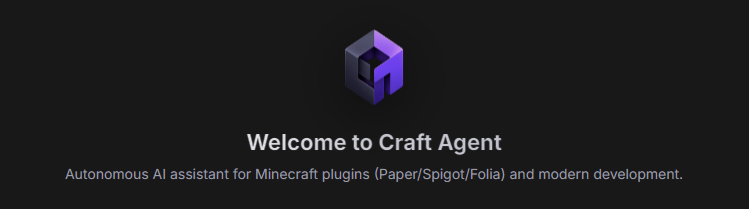

<div align="center">



# Craft Agent 🛠️🤖

**Autonomous Desktop AI Coding Assistant Specialized in Minecraft Plugin Development & Modern Software Engineering**

[](https://github.com/jipanjiji/CraftAgent)
[](https://www.electronjs.org/)
[-8b5cf6?style=flat-square)](https://xkiro.com)
[](LICENSE)
[]()

<br>

[📥 **Download Portable Executable (.exe)**](https://github.com/jipanjiji/CraftAgent/releases/download/v1.0.6/Craft.Agent.1.0.6.exe) &nbsp;•&nbsp; [💾 **Download Windows Installer (.exe)**](https://github.com/jipanjiji/CraftAgent/releases/download/v1.0.6/Craft.Agent.Setup.1.0.6.exe) &nbsp;•&nbsp; [🚀 **Latest Release (v1.0.6)**](https://github.com/jipanjiji/CraftAgent/releases/tag/v1.0.6)

</div>

---

## 🌟 Overview

**Craft Agent** is a full-featured desktop AI pair programmer designed specifically for Minecraft server administrators, plugin developers, and general software engineers. Built on Electron with a distraction-free obsidian aesthetic, Craft Agent connects to the **xKiro API Gateway** to grant instant access to over **109+ state-of-the-art AI models** (DeepSeek, Claude Sonnet/Opus, GPT-5.6, Gemini Flash/Pro, Qwen Coder, Mistral, and more).

Whether you need to scaffold a Paper 1.20+ teleportation plugin, build production `.jar` binaries with Gradle Wrapper, inspect workspace trees, decompile/read `.jar` archives natively, search live PaperMC docs, or remotely edit configs on a server panel via WinSCP, Craft Agent executes the entire workflow autonomously.

---

## 🚀 Instant Download (Ready-to-Use)

No Node.js or development environment needed! Simply download the standalone Windows build from the [v1.0.6 Release](https://github.com/jipanjiji/CraftAgent/releases/tag/v1.0.6):

| Package Type | File Name | Description |
| :--- | :--- | :--- |
| **⭐ Portable Executable** | [**`Craft.Agent.1.0.6.exe`**](https://github.com/jipanjiji/CraftAgent/releases/download/v1.0.6/Craft.Agent.1.0.6.exe) | **Zero installation required.** Double-click to run immediately anywhere (USB, Google Drive, Desktop). |
| **Windows Installer** | [**`Craft.Agent.Setup.1.0.6.exe`**](https://github.com/jipanjiji/CraftAgent/releases/download/v1.0.6/Craft.Agent.Setup.1.0.6.exe) | Complete setup wizard with Desktop shortcuts and Start Menu integration. |

---

## ✨ Key Features

### ⚡ Autonomous Minecraft Plugin Suite Generation
- Creates complete, production-ready Paper/Spigot/Folia/Purpur projects out of the box:
  - `build.gradle` & `settings.gradle` with Java 21 toolchains and Paper API dependencies.
  - `plugin.yml` / `paper-plugin.yml` with commands, permissions, and aliases.
  - Complete Java source files (`MainClass`, command executors, managers, event listeners).
- Automatically invokes `./gradlew build --no-daemon` to compile `.jar` artifacts into `build/libs/`.

### 🛡️ Dual Security & Permission Modes
- **Approval Required (Human-in-the-Loop)**: Displays an interactive confirmation modal (with 60s auto-deny safety timeout) before executing any command on your machine.
- **Full Access (Autonomous)**: AI directly executes shell commands without popup interruptions, enabling uninterrupted, hands-free compilation and file operations.

### 🔍 Live Model Search Across 109+ Models
- Connect to xKiro Gateway with models across 15 world-class vendors:
  - **OpenAI**: GPT-5.6 Sol, Terra, Luna, GPT-5.4 Mini, Codex Spark
  - **Anthropic**: Claude Opus 5, Claude Sonnet 5, Haiku 4.5
  - **DeepSeek**: DeepSeek-v4 Flash, DeepSeek Reasoner, DeepSeek-Coder
  - **Google**: Gemini 3.8 Flash, 3.7 Flash, 3.1 Pro
  - **Mistral, xAI Grok, Moonshot Kimi, Qwen, GLM, MiniMax**
- Instant real-time search input in Settings to find any model by name, ID, or vendor.

### 🖥️ WinSCP Remote Minecraft Panel Automation
- Native comprehension of **WinSCP Command-Line (`winscp.com`)**:
- Connects to remote Minecraft servers (Pterodactyl, Pelican, VPS, Dedicated):
  1. Downloads remote configuration or plugin files to your local workspace.
  2. Inspects and patches values precisely with `patch_file`.
  3. Uploads the modified file back to the server panel automatically.

### 🌐 Real-Time Web Intelligence
- Built-in DuckDuckGo search integration to query the latest PaperMC APIs, Spigot events, or compiler errors.
- Automatic webpage scraper using Cheerio to extract clean technical documentation without ads or HTML bloat.

### 📁 Smart File Management & Token Efficiency
- `read_file` with strict path traversal boundaries.
- `write_file` for atomic file and directory creation.
- `patch_file` for token-efficient search-and-replace block edits.
- Strict 15-message token sliding window to preserve memory and context integrity across long sessions.
- `.jar` artifacts in `build/libs/` are automatically kept visible for instant verification.

### 🛡️ Autonomous Bytecode & Security Auditing (`/analyze <url>`) (v1.0.6)
- Autonomous end-to-end Modrinth artifact auditing: automatically fetches the `.jar` binary into `.craft/temp/`, decompiles and inspects manifests (`plugin.yml`, `paper-plugin.yml`, `fabric.mod.json`) and bytecode classes via `inspect_jar`, and cleans up temporary files with `delete_file`.
- Delivers a 5-pillar security report (backdoor/malware detection, permission escalations, suspicious network endpoints, thread-safety/Folia compatibility, and TPS impact).

### ⚙️ Customizable Max Context Window (8k - 1M Tokens) (v1.0.6)
- Configurable context memory token budget directly in Settings with a numeric input clamped between 8,000 and 1,000,000 tokens (default upgraded to 64,000 tokens).
- Accommodates massive modern context windows (DeepSeek V3, Qwen 2.5/3.5, Gemini 1.5/2.5 Pro) without sacrificing speed or budget control.

### 📦 Modrinth Content Hub & Smart Downloader
- Search and explore mods, plugins, datapacks, resource packs, shaders, and modpacks directly inside the app.
- Filter by loaders (Paper, Spigot, Fabric, Forge, NeoForge, Quilt, etc.) and Minecraft versions.
- Official release download modal with automated dependency resolution: single-click installation with dependencies directly into your workspace (`plugins/` or `mods/`).
- One-click **AI Deep Audit**: Instantly audits any selected mod/plugin for security vulnerabilities, configuration options, server impact, and Folia/TPS performance.

### 🔍 Interactive Visual Diff Preview
- Color-coded unified and split line-by-line diff engine.
- Instant visual verification of file modifications (`patch_file` / `write_file`) before and after execution.

### 🎨 Obsidian Minimalist Interface
- Carefully calibrated `#181818` dark theme with high-contrast `#303034` inline code pills.
- Chronological step accordions: expandable `Worked for...` sections keeping your workspace tidy.
- Live streaming output, copy-to-clipboard buttons, clean SVG iconography, quota usage tracker, and responsive chat column alignment.

---

## 🛠️ Development & Building from Source

### Prerequisites
- [Node.js](https://nodejs.org/) (v18 or newer recommended, tested on Node v24)
- npm (bundled with Node.js)

### 1. Clone the Repository
```bash
git clone https://github.com/jipanjiji/CraftAgent.git
cd CraftAgent
```

### 2. Install Dependencies
```bash
npm install
```

### 3. Run in Development Mode
```bash
npm start
```

### 4. Run Automated Test Suite
```bash
npm test
```

### 5. Build Executables (`.exe`)
```bash
# Build both Installer and Portable executables:
npm run dist

# Or build the single portable executable only:
npm run dist:portable
```
The compiled binaries will be placed in the `release/` directory.

---

## 🎯 Quick Configuration Guide

1. Launch Craft Agent.
2. Open **Settings (⚙)** in the top right header.
3. Input your **xKiro API Key**.
4. Use the search bar to pick your desired model (e.g. `openai/gpt-5.6-terra` or `deepseek/deepseek-v4-flash`).
5. Choose your **Security Mode**:
   - Select *Approval Required* for manual verification of each terminal command.
   - Select *Full Access* for uninterrupted autonomous builds.
6. Click **Save Changes**.
7. Click **Select Workspace** to choose your project folder and start building!

---

## 📂 Project Structure

```
CraftAgent/
├── assets/                      # Application banners and documentation assets
├── main.js                      # Electron main process & IPC handlers
├── preload.js                   # Secure contextBridge bridge
├── package.json                 # Project configuration & build scripts
├── test-suite.js                # Integration and regression test suite
├── README.md                    # Project documentation
├── release/                     # Packaged Windows standalone executables
│   ├── Craft Agent 1.0.0.exe    # Portable standalone executable
│   └── Craft Agent Setup 1.0.0.exe # Windows NSIS installer
├── src/
│   ├── ai-engine.js             # AI orchestrator & function calling loop
│   ├── config-manager.js        # Configuration store & 109+ model catalog
│   ├── history-manager.js       # Sliding window context & token manager
│   ├── system-prompt.js         # Token-optimized system prompt
│   └── tools/
│       ├── file-manager.js      # Safe read, write, and patch file tools
│       ├── terminal-executor.js # Shell executor with HITL & auto-timeout
│       ├── workspace-scanner.js # Recursive ASCII tree project scanner
│       └── web-intelligence.js  # Live web search & webpage scraper
└── renderer/
    ├── index.html               # Main desktop interface
    ├── styles.css               # Obsidian design system
    ├── app.js                   # UI renderer logic & event bus
    ├── settings.html            # Standalone settings window
    ├── settings.css             # Settings page styles
    ├── settings.js              # Settings page interaction handler
    └── assets/                  # Icons and branding
```

---

## 📄 License

This project is licensed under the **MIT License** - see the [LICENSE](LICENSE) file for details.

---

<div align="center">
  <sub>Crafted with passion by <strong>Alvin</strong> for the Minecraft & Developer Community.</sub>
</div>
